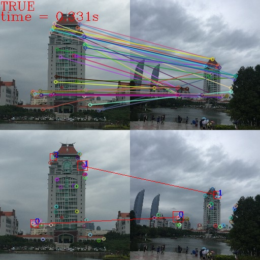
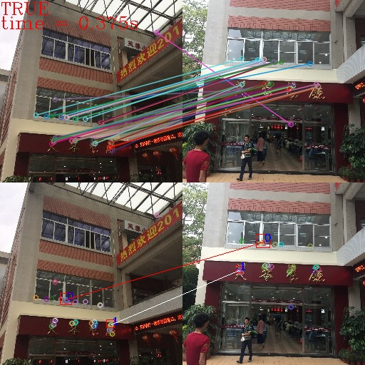
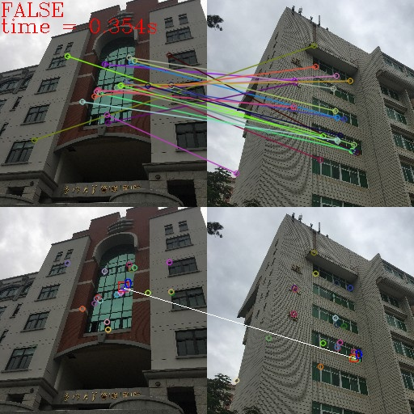

# XMU Lankmark Comparsion

## Project Introduction

The project is designed for a XMU visitor guide application. When user reached one of the landmarks in XMU and upload its picture, the user gets credits in his/her account. It is an early-stage prototype and only focuses on comparing images which are uploaded by users and target landmark images.  Given two pictures of landmarks in Xiamen University, one is taken by visitor and the other is a sample for comparison.  Our algorithm decides whether they are the same place. 

## Algorithm Description

### Step 1: Extract Feature Points ###  

As users might take photos from different perspective and zoom in or out the photos, we need a method to extract feature points that is not sensitive to scaling and perspective changes. Thus, we choose ORB in the algorithm.   

ORB combines FAST and BRIEF. FAST algorithm is used to extract feature points while BRIEF algorithm is used to generate descriptors. Although BRIEF algorithm is variant to scale and orientation, ORB eliminates this weakness by introducing rBRIEF. The comparison between different methods is listed below.

|Method|Rotation Invariant|Scale Invariant|Perspective Distortion|Noise|
|--|--|--|--|--|
| SIFT/SURF | True  | True  | Stable   | Sensitive   |
| FAST/BRIEF| False | False | Unstable | InSensitive |
| ORB       | True  | False | Stable   | InSensitive |

### Step 2: Match Feature Points with Target ###

The feature points of target picture is stored in advance. In this step, we try to find matched feature points based on their positions, color and density.  

### Step 3: Cluster Matched Feature Points ###

The input of the clustering algorithm is the coordinates of points and the output is the cluster center. The algorithm considers one or more point in the input as the cluster center. The cluster center selection is based on two simple parameters, the density of each point and the minima distance to the point which has a higher density than itself. Then it uses thresholds to determine whether a point is the center.  

Here we implement the clustering algorithm introduced in [1], which helps reduce the computational complexity and provides precise area for future comparison.  

### Step 4: Match Clusters with Target ###
The reason for matching cluster with target image is that we need a secondary verification. It is common that the same pattern appears in the left side of user photo and in the right side of target photo, they are matched in step 2 but might not be a pair in ground truth. Thus, the algorithm considers the clusters and filters out unqualified  ones. 

### Step 5: Calculate Similarity ###
Similarity is calculated according to the cluster size and the points in cluster.   

## Result
The result image includes 4 sub-images. Sub-images on the top left and the top right show the result of matching feature points. Sub-images on the bottom left and the bottom right show the result of matching qualified clusters. The text on the top left indicates whether the alogrithm thinks they are the same place and execution time it takes. The first two images are positive samples and the last one is the result of comparing noise.  
  
  
  

## Reference
[1] [Clustering by fast search and find of density peaks](https://science.sciencemag.org/content/344/6191/1492.figures-only)  
[2] [Faster and better: a machine learning approach to corner detection](https://arxiv.org/pdf/0810.2434.pdf)  
[3] [BRIEF (Binary Robust Independent Elementary Features)](https://docs.opencv.org/master/dc/d7d/tutorial_py_brief.html)  
[4] [ORB (Oriented FAST and Rotated BRIEF)](https://docs.opencv.org/3.0-beta/doc/py_tutorials/py_feature2d/py_orb/py_orb.html?highlight=orb)